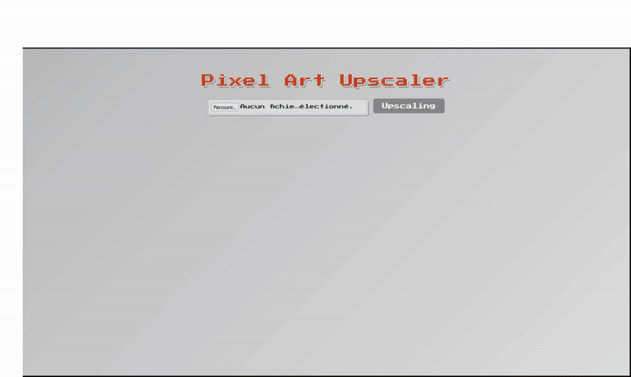

# Projet : Amélioration d’images pixel art de jeux vidéo avec ESRGAN

## Objectif

Ce projet vise à entraîner et à utiliser un modèle ESRGAN pour améliorer la qualité d’images pixelisées issues d’assets de jeux vidéo old school (type pixel art). L’objectif est de transformer des images basse résolution en versions haute résolution, tout en préservant le style graphique d’origine.

## Étapes réalisées

1. **Création du dataset**
   - Génération d’un dataset personnalisé composé d’images pixel art : chaque image haute résolution (HR) est associée à une version basse résolution (LR) obtenue par réduction de taille.
   - Nettoyage du dataset : suppression automatique des images trop petites pour garantir la cohérence des paires HR/LR.

2. **Configuration du modèle**
   - Personnalisation du fichier YAML de configuration pour adapter l’entraînement du modèle ESRGAN à la spécificité du dataset gaming pixel art.
   - Le fichier de configuration YAML nécessaire au fine-tuning se trouve dans le dossier `tools` :  
     `tools/train_gaming_x4.yml`

3. **Entraînement du modèle**
   - Lancement de l’entraînement avec BasicSR en utilisant le dataset et le fichier YAML personnalisé.
   - Ajustement de la fréquence de sauvegarde des checkpoints pour faciliter le suivi et la reprise de l’entraînement.

4. **Test et utilisation**
   - Le modèle fine-tuné peut être utilisé pour améliorer n’importe quelle image de pixel art similaire au dataset d’entraînement.
   - Possibilité d’intégrer le modèle dans une interface web pour traiter des images importées par l’utilisateur.

## Organisation des dossiers

- `dataset/` : Contient les images HR (high_res) et LR (low_res) utilisées pour l’entraînement.
- `ESRGAN/` : Scripts, architecture du modèle et ressources liées à ESRGAN (utiles pour l’expérimentation ou la personnalisation).
- `BasicSR/` : Framework utilisé pour l’entraînement et le test du modèle.
- `models/` : Contient les checkpoints (.pth) générés lors de l’entraînement.
- `tools/` :  
  - Contient le fichier de configuration YAML (`train_gaming_x4.yml`) nécessaire au fine-tuning du modèle.

## Utilisation

1. **Préparer le dataset**  
   Placer les images HR et LR dans les dossiers appropriés sous `dataset/`.

2. **Configurer l’entraînement**  
   Modifier le fichier YAML dans `tools/` selon les besoins.

3. **Lancer l’entraînement**  
   Utiliser BasicSR avec le fichier de configuration pour démarrer le fine-tuning.

4. **Tester le modèle**  
   Utiliser les scripts de test pour appliquer le modèle sur de nouvelles images pixel art.

## Remarques

- Le modèle fine-tuné est optimisé pour le style d’images présent dans le dataset. Pour de meilleurs résultats sur d’autres styles, il est conseillé d’enrichir le dataset.
- Le dossier `ESRGAN` reste utile pour explorer l’architecture ou adapter le modèle selon les besoins.
